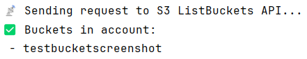
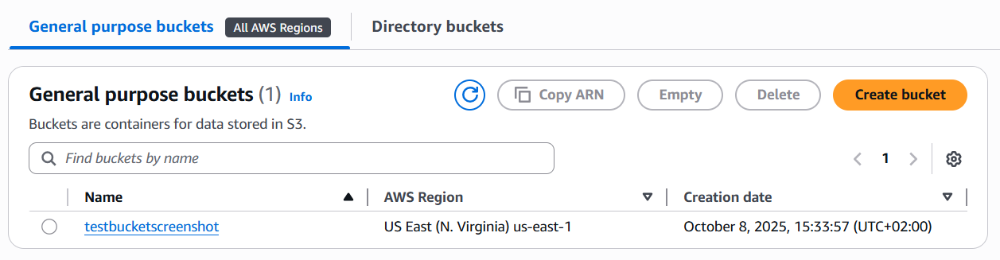
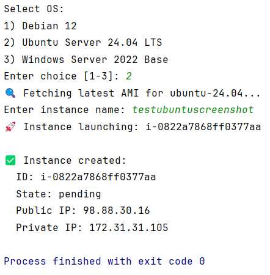
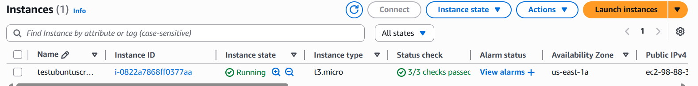
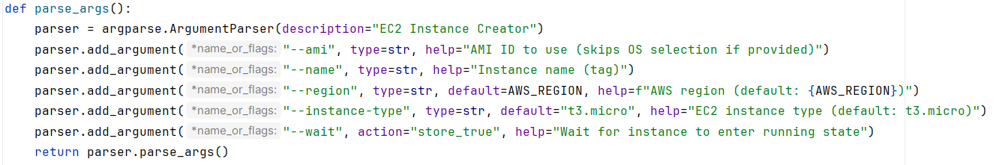

# AWS-Deployment-Challenge-1

## Part 1
For part 1 I asked AI to generate me the script but there where some things that weren't correct. For example the first version of the script didn't include the session token. For the second version i asked to make the .env file auto load. After these adjustments i tried running the code but got this error: "❌ Request failed: 400 <Error><Code>InvalidRequest</Code><Message>Missing required header for this request: x-amz-content-sha256</Message>". I gave this error to AI and he knew what was wrong. AWS now requires the x-amz-content-sha256 header in SigV4 requests. After this my script works. So it is important to correctly hash the payload.
### Key Steps in SigV4 Authentication
1.	Create a Canonical Request 
•	Define HTTP method, URI, headers and a hash of the payload. 
•	Example in code: canonical_request variable.
2.	Create a String to Sign 
•	Combine hashing algorithm, request date, credential scope and hashed canonical request. 
•	Example in code: string_to_sign.
3.	Calculate the Signature 
•	Take the signing key from the secret key using HMAC-SHA256 over date, region and service. 
•	Example in code: get_signature_key().
4.	Add Authorization Header 
•	Construct the Authorization header with signed headers and the signature. 
•	Example in code: authorization_header.
5.	Send the Request 
•	Use requests.get() with the signed headers.

## Part 2
For part 1 I built a script that directly called the AWS S3 REST API using the requests library.
This required manually implementing AWS SigV4 authentication.
To make a single call I had to:
1.	Construct a canonical request (HTTP method, headers, payload hash).
2.	Create a string to sign that included the date, region and service.
3.	Generate a signing key using HMAC with the secret key and date.
4.	Use the final signature and add it to the Authorization header.
This process took more time and it was more likely to get errors. Any small mistake like missing a header or wrong hash resulted in a error 400.
It gave me a good understanding of how AWS authenticates requests, but it’s not practical for production.

For part 2 the boto3 SDK handled all the complexity for me. For example: 
•	Authentication and signing automatically. 
•	Built-in error handling. 
•	Simplified parameters: creating instances, fetching AMIs and tagging resources only require simple method calls (create_instances(), describe_images(),...

Overall, boto3 reduces development time because you don't need to reimplement SigV4 or parse XML. Also increases reliability and consistent error messages. Improves maintainability because of cleaner code, integrates well with CI/CD environments and other AWS services.

I only have one critique of boto3 and that is when i tried to run my ec2 instance creator the next day and i changed my credentials in my .env file i got a error but it wasen't clear why but when I ran my other script of part 1 it told me that my credentials were invalid.

## Extra Points

